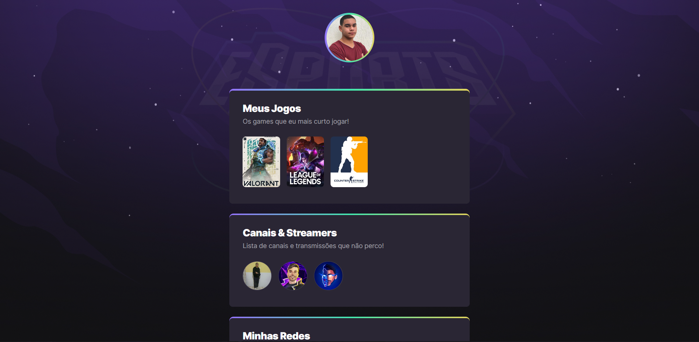

<h1 align="center">NLW eSports</h1>
<h4 align="center">🤯 Finalizado! </h4>

Projeto construído do evento Next Level Week da Rocketseat.

> Trilha Explorer

[🔗 Clique aqui para acessar](https://leandro-bezerra-santos.github.io/Nlw-eSports-Explorer/)

## ⚡ Tecnologias
As seguintes tecnologias foram usadas na construção do projeto:

- [HTML5](https://www.w3schools.com/html/)
- [CSS3](https://www.w3schools.com/css/)
- [GIT](https://git-scm.com/)
- [GITHUB](https://github.com/)
---
## 💛 Contato
- leandrodiasbezerra95@gmail.com

---

## 📝 Licença
Este projeto está sobe a licença <a href="LICENCE">MIT</a>

---

## 📜 Versões do README
[Português BR](./README.md)